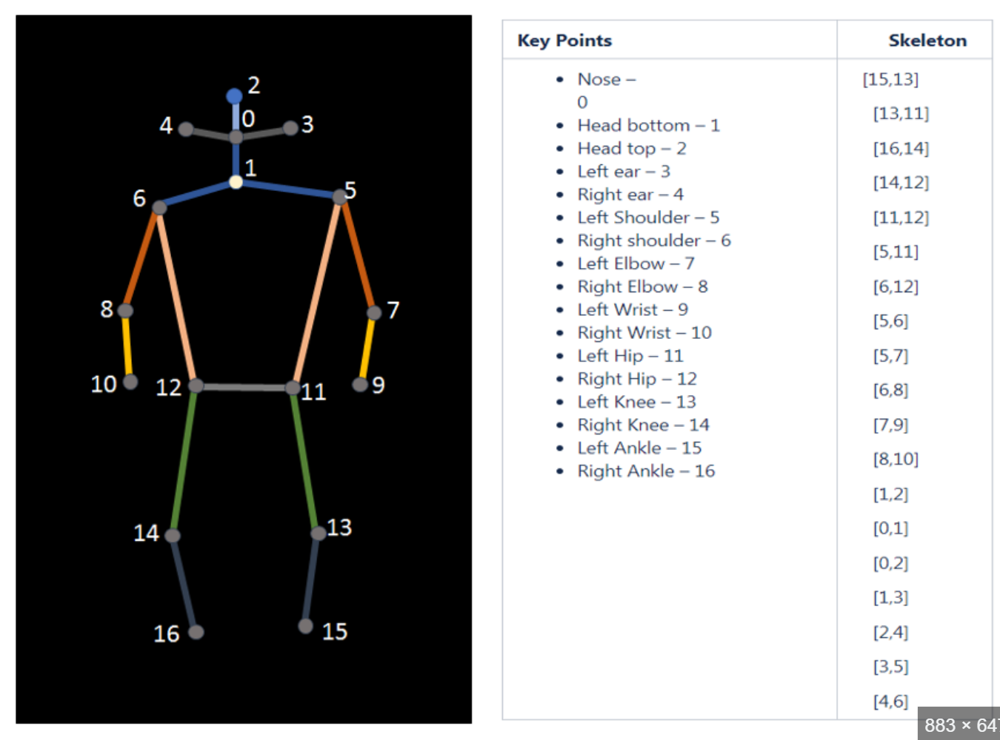

# ViTPose (simple version)
An unofficial implementation of ViTPose [Y. Xu et al., 2022] <br>


## Usage

### Keypoint definition
```
"coco": {
                0: "nose",
                1: "left_eye",
                2: "right_eye",
                3: "left_ear",
                4: "right_ear",
                5: "left_shoulder",
                6: "right_shoulder",
                7: "left_elbow",
                8: "right_elbow",
                9: "left_wrist",
                10: "right_wrist",
                11: "left_hip",
                12: "right_hip",
                13: "left_knee",
                14: "right_knee",
                15: "left_ankle",
                16: "right_ankle"
            }
```

### | **Inference**
```
python inference.py --image-path './examples/img1.jpg'
```

### | **Training**
```
python train.py --config-path config.yaml --model-name 'b'
```
- `model_name` must be in (`b`, `l`, `h`)


## Note
1.  Download the trained model (.pth) and place under vitpose/support_data/vitpose
    - [ViTPose-B-Multi-COCO.pth](https://1drv.ms/u/s!AimBgYV7JjTlgSrlMB093JzJtqq-?e=Jr5S3R)
    - [ViTPose-L-Multi-COCO.pth](https://1drv.ms/u/s!AimBgYV7JjTlgTBm3dCVmBUbHYT6?e=fHUrTq)
    - [ViTPose-H-Multi-COCO.pth](https://1drv.ms/u/s!AimBgYV7JjTlgS5rLeRAJiWobCdh?e=41GsDd)

[//]: # (2. Set the config. according to the trained model)

[//]: # (    - [ViTPose-B-COCO-256x192]&#40;/Users/jaehyun/workspace/ViTPose_pytorch/configs/ViTPose_base_coco_256x192.py&#41; )

[//]: # (    - [ViTPose-L-COCO-256x192]&#40;/Users/jaehyun/workspace/ViTPose_pytorch/configs/ViTPose_large_coco_256x192.py&#41; )

[//]: # (    - [ViTPose-H-COCO-256x192]&#40;/Users/jaehyun/workspace/ViTPose_pytorch/configs/ViTPose_huge_coco_256x192.py&#41; )

---
## Reference
All codes were written with reference to [the official ViTPose repo.](https://github.com/ViTAE-Transformer/ViTPose)