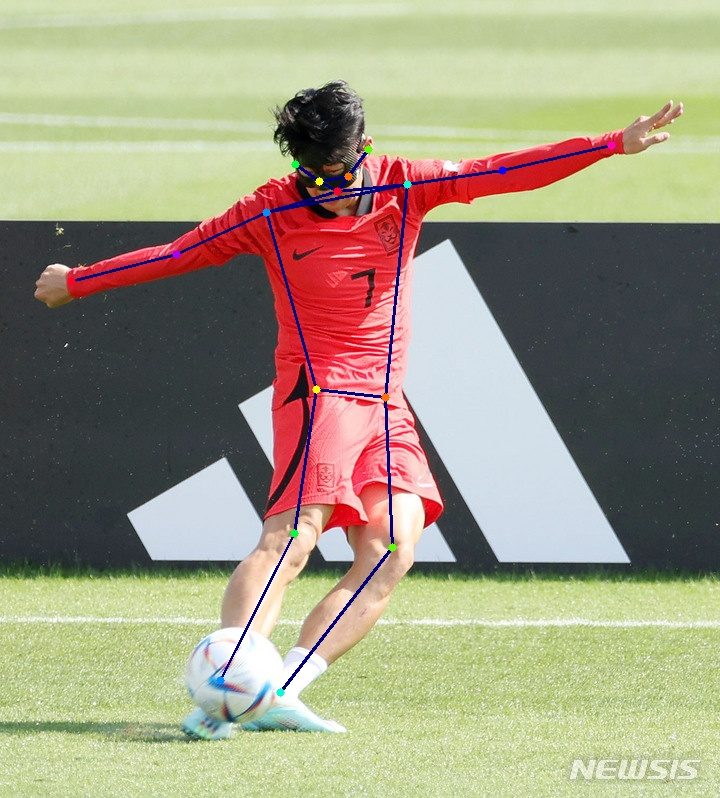

# ViTPose (simple version w/o mmcv)
An unofficial implementation of `ViTPose` [Y. Xu et al., 2022] <br>


## Installation

```bash
# Clone the repository
git clone https://github.com/jaehyunnn/ViTPose_pytorch.git
cd ViTPose_pytorch

# Install dependencies
pip install -r requirements.txt
```

**Requirements:**
- Python >= 3.8
- PyTorch >= 1.9.0
- torchvision
- numpy, opencv-python, pillow, tqdm

## Pretrained Models & Configs

| Model | Backbone | Input Size | Config | Weights |
|-------|----------|------------|--------|---------|
| ViTPose-B | ViT-Base | 256x192 | [config](./configs/ViTPose_base_coco_256x192.py) | [download](https://1drv.ms/u/s!AimBgYV7JjTlgSrlMB093JzJtqq-?e=Jr5S3R) |
| ViTPose-L | ViT-Large | 256x192 | [config](./configs/ViTPose_large_coco_256x192.py) | [download](https://1drv.ms/u/s!AimBgYV7JjTlgTBm3dCVmBUbHYT6?e=fHUrTq) |
| ViTPose-H | ViT-Huge | 256x192 | [config](./configs/ViTPose_huge_coco_256x192.py) | [download](https://1drv.ms/u/s!AimBgYV7JjTlgS5rLeRAJiWobCdh?e=41GsDd) |

## Usage

### Inference
```bash
python inference.py --image-path './examples/img1.jpg'
```

### Training
```bash
python train.py --config-path config.yaml --model-name 'b'
```
- `model_name`: `b` (Base), `l` (Large), `h` (Huge)

---
## Reference
All codes were written with reference to [the official ViTPose repo.](https://github.com/ViTAE-Transformer/ViTPose)