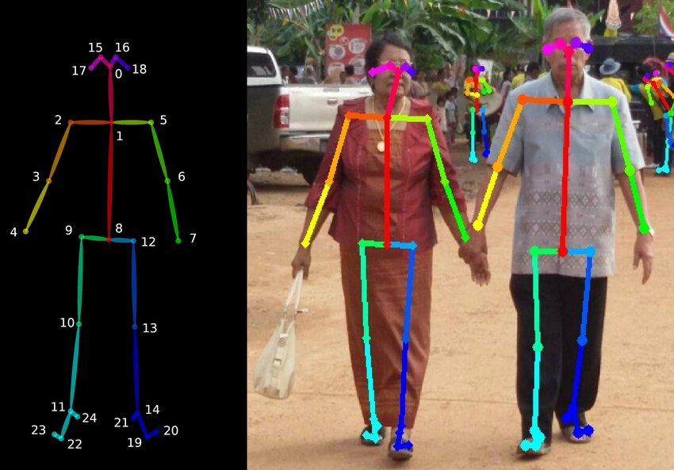
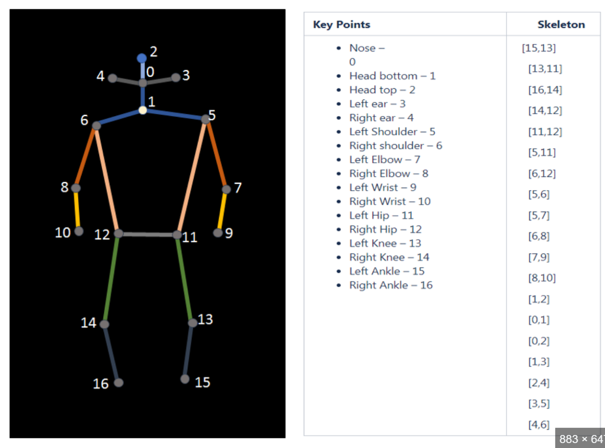

# ViTPose 

An unofficial implementation of ViTPose [Y. Xu et al., 2022] <br>

### Keypoint definition
#### Body25
    "body25": {
                0: "nose",
                1: "left_eye",
                2: "right_eye",
                3: "left_ear",
                4: "right_ear",
                5: "neck",
                6: "left_shoulder",
                7: "right_shoulder",
                8: "left_elbow",
                9: "right_elbow",
                10: "left_wrist",
                11: "right_wrist",
                12: "left_hip",
                13: "right_hip",
                14: "hip",
                15: "left_knee",
                16: "right_knee",
                17: "left_ankle",
                18: "right_ankle",
                19: "left_big toe",
                20: "left_small_toe",
                21: "left_heel",
                22: "right_big_toe",
                23: "right_small_toe",
                24: "right_heel",
            }


#### COCO17
```
"coco17": {
                0: "nose",
                1: "left_eye",
                2: "right_eye",
                3: "left_ear",
                4: "right_ear",
                5: "left_shoulder",
                6: "right_shoulder",
                7: "left_elbow",
                8: "right_elbow",
                9: "left_wrist",
                10: "right_wrist",
                11: "left_hip",
                12: "right_hip",
                13: "left_knee",
                14: "right_knee",
                15: "left_ankle",
                16: "right_ankle"
            }
```


### | **Inference**
```
python inference.py --image-path './examples/img1.jpg'
```

### | **Training**
```
python train.py --config-path config.yaml --model-name 'b'
```
- `model_name` must be in (`b`, `l`, `h`)


## Weights
##### COCO17:
    Download the trained model (.pth) and place under vitpose/support_data/vitpose
    - [ViTPose-B-Multi-COCO.pth](https://1drv.ms/u/s!AimBgYV7JjTlgSrlMB093JzJtqq-?e=Jr5S3R)
    - [ViTPose-L-Multi-COCO.pth](https://1drv.ms/u/s!AimBgYV7JjTlgTBm3dCVmBUbHYT6?e=fHUrTq)
    - [ViTPose-H-Multi-COCO.pth](https://1drv.ms/u/s!AimBgYV7JjTlgS5rLeRAJiWobCdh?e=41GsDd)
#### Body25
Download the models from [Huggingface](https://huggingface.co/JunkyByte/easy_ViTPose).
Credit: https://github.com/JunkyByte/easy_ViTPose

---
## Reference
All codes were written with reference to [the official ViTPose repo.](https://github.com/ViTAE-Transformer/ViTPose)
